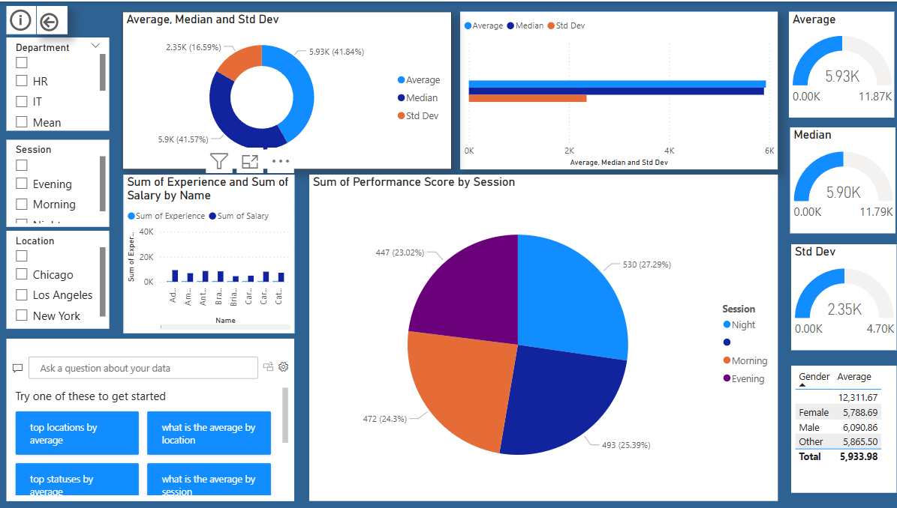

# Employee_Dashboard

This interactive Power BI dashboard provides a comprehensive analysis of employee salary data. It includes key insights into salary distribution by department, gender, education level, job role, and experience. Designed to assist HR professionals and analysts in identifying compensation trends, workforce demographics, and equity gaps across the organization.

